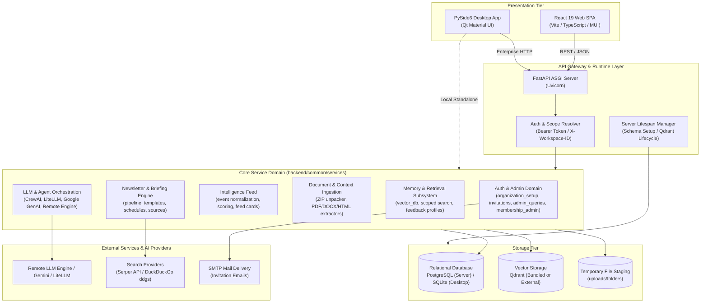
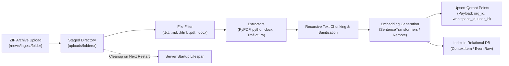
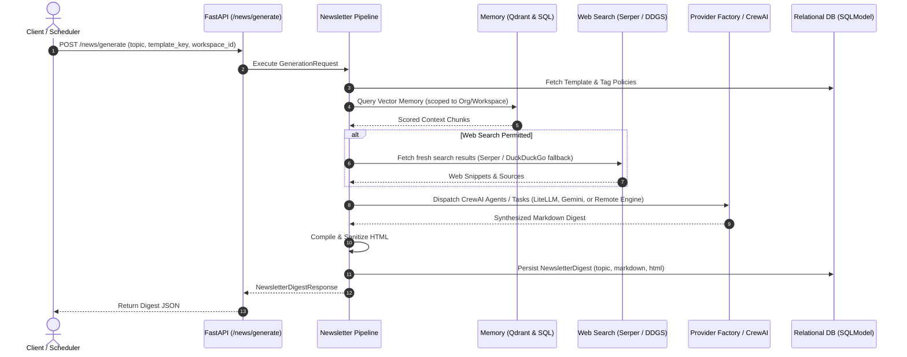
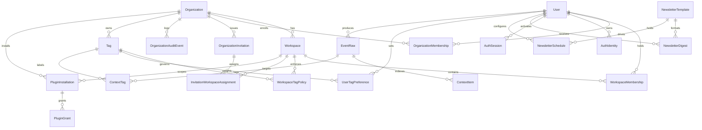
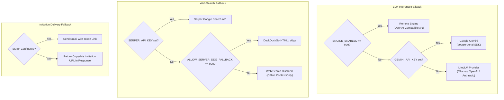

# Lumeward System Architecture

**Target Release:** `1.0.0-beta.1`  
**Status:** Active Design & Architecture Reference  

---

## 1. Executive Summary & Core Principles

Lumeward is an intelligence workspace and personalized briefing engine designed for privacy-first personal workstations and multi-tenant enterprise environments. The system architecture is built around three fundamental tenets:

1. **Dual-Runtime Flexibility:** A single shared Python service core powers both a lightweight local desktop application (PySide6 with embedded SQLite and Qdrant) and a scalable enterprise server (FastAPI with PostgreSQL, bundled/external Qdrant, and React 19 web client).
2. **Zero-Leakage Multitenancy:** Strict three-tier tenant boundaries (`Organization` $\rightarrow$ `Workspace` $\rightarrow$ `User`) enforced at API gateway routing, SQL transaction scopes, and Qdrant vector payload filters.
3. **Resilient AI Pipeline:** Pluggable LLM provider abstractions (CrewAI, LiteLLM, Google Gemini, and OpenAI-compatible Remote Engines) coupled with autonomous web search fallback (Serper API $\rightarrow$ DuckDuckGo) and feedback-driven vector memory.

---

## 2. High-Level System Architecture & Topology

The following diagram illustrates the end-to-end system topology across presentation, gateway, service domain, storage, and external provider layers:



---

## 3. Dual Runtime Modes & Trust Boundaries

Lumeward can be executed in two distinct modes via `backend/main.py`:

```
uv run python backend/main.py --mode {server|desktop} --auth-mode {interactive|shared}
```

### Runtime Mode Comparison Matrix

| Capability / Layer | Local Desktop Mode (`DESKTOP`) | Enterprise Desktop Client (`DESKTOP`) | Server Mode (`SERVER`) |
| :--- | :--- | :--- | :--- |
| **User Interface** | Native PySide6 (Qt) | Native PySide6 (Qt) | React 19 Web Client (Vite/MUI) |
| **Relational Storage** | SQLite (`sqlite:///lumeward.db`) | Local SQLite for UI prefs | PostgreSQL (`psycopg` binary engine) |
| **Vector Engine** | Embedded/bundled local Qdrant | Server-side remote Qdrant | Bundled native Qdrant or external cluster |
| **Identity & Auth** | Fixed local synthetic identity | Remote session bearer token | Session-based (`interactive`) or `shared` |
| **OS Integrations** | Local clipboard watcher, native FS | Local file sharing (consented) | None (isolated server filesystem) |
| **Execution Context** | Local machine execution | Remote server execution | Remote server execution |

### Trust Boundaries & Isolation

1. **Local Desktop Isolation:** All data, embeddings, and credentials remain on the user's workstation. External requests only leave the machine for LLM inference (unless using a local Ollama/OpenAI-compatible engine) and web search queries.
2. **Enterprise Server Boundary:** 
   - Requests entering the FastAPI server require an `Authorization: Bearer <token>` header.
   - Tenant scoping requires an `X-Workspace-ID: <id>` header.
   - The security resolver rejects requests where the user does not possess active membership within the target organization or workspace.
3. **Data Boundary for AI Models:** Context items are scrubbed and sanitized before being packaged into prompt payloads for external LLM inference. Muted or blocked tags are filtered before context aggregation.

---

## 4. Identity, Authentication & Multitenancy Architecture

### Multi-Tenancy Hierarchy

```
Organization (Root Tenant)
 ├── OrganizationMembership (Role: organization_admin | member)
 ├── OrganizationInvitation (Pending / Accepted / Expired / Revoked)
 ├── OrganizationAuditEvent (Immutable audit trail)
 └── Workspace (Sub-Tenant / Team Partition)
      ├── WorkspaceMembership (Role: workspace_admin | member)
      ├── WorkspaceTagPolicy (Allowed / Blocked / Prioritized topics)
      ├── SharedContextItem (Workspace documents and text)
      └── NewsletterSchedule (Workspace-level or user-level digests)
```

### Role-Based Access Control (RBAC)

* **`organization_admin`**:
  * Full administrative rights across the organization.
  * Invite new users and assign default workspace roles.
  * Create, rename, and archive workspaces.
  * Audit log inspection and organization-wide tag management.
* **`workspace_admin`**:
  * Administrative privileges restricted exclusively to assigned workspaces.
  * Manage workspace-specific context items and workspace tag policies.
  * Inspect workspace membership list.
* **`member`**:
  * General participant.
  * Access permitted shared workspace context.
  * Generate newsletters and briefings within assigned workspaces.
  * Maintain personal tag preferences and feedback profiles.

### Session & Token Security

* **Hash-Only In-Database Storage:** Authentication sessions and invitations never persist plaintext tokens. Tokens generated via `secrets.token_urlsafe(32)` are immediately SHA-256 hashed before storage in `AuthSession.token_hash` and `OrganizationInvitation.token_hash`.
* **Atomic Signups:** New organization registrations (`signup_organization` in `organization_setup.py`) execute within a single atomic database transaction:
  1. Creates `User` and hashes password with Argon2.
  2. Creates `Organization` with unique URL slug.
  3. Creates `AuthIdentity` (`provider="interactive"`).
  4. Creates `OrganizationMembership` (`role="organization_admin"`).
  5. Records `OrganizationAuditEvent` (`action="organization.created"`).
  6. Creates and issues the first `AuthSession`.
  If any step fails, the entire transaction is rolled back.

---

## 5. Core Subsystem & Service Architecture

### 5.1 Ingestion & Document Processing Pipeline

The ingestion subsystem converts heterogeneous document formats and folder archives into vector embeddings and searchable context.



* **Staged Cleanup:** Uploaded ZIP archives and unzipped directories are stored temporarily under `uploads/folders/`. On server restart, `cleanup_managed_uploads_on_startup()` purges these temporary staging artifacts while retaining the indexed state in PostgreSQL and Qdrant.
* **Concurrency Control:** Ingestion operations are bounded by an `asyncio.Semaphore` governed by `INGESTION_CONCURRENCY` to prevent memory exhaustion during heavy parallel document uploads.

---

### 5.2 Memory & Vector Retrieval Subsystem

Vector search is managed through `backend/common/services/memory/vector_db.py`.

* **Multitenant Vector Payload Filtering:** Every point stored in Qdrant contains payload metadata:
  ```json
  {
    "organization_id": 1,
    "workspace_id": 4,
    "user_id": 12,
    "visibility": "workspace",
    "tags": ["cloud", "security"]
  }
  ```
  Retrieval queries apply strict boolean filter clauses ensuring that users cannot retrieve vectors outside their active organization and authorized workspace.
* **Qdrant Process Lifecycle:** `backend/server/qdrant_runtime.py` dynamically handles starting, monitoring, and shutting down bundled native Qdrant server binaries on Windows, Linux, and macOS when an external Qdrant instance is not configured.
* **Derived Memory & Personalization:** User feedback on generated briefs updates `DerivedMemory` and user profile preferences, dynamically weighting relevant tags and prompt hint context in subsequent generations.

---

### 5.3 Newsletter & Briefing Generation Pipeline

The generation pipeline orchestrates context retrieval, web search enrichment, agent planning, and markdown compilation.



* **Provider Routing:** `backend/common/services/llm/provider_factory.py` resolves models based on operational flags:
  1. **Remote Engine:** OpenAI-compatible remote endpoint (`ENGINE_BASE_URL`, `ENGINE_API_KEY`) when `ENGINE_ENABLED=true`.
  2. **Google GenAI:** Native Gemini models when `GEMINI_API_KEY` is provided.
  3. **LiteLLM:** Universal bridge for Anthropic, OpenAI, or local Ollama instances.

---

## 6. Relational Data Architecture (Entity-Relationship)

The schema is defined in SQLModel (`backend/common/models/sql.py`), combining SQLAlchemy table definitions with Pydantic validation:



---

## 7. External Integrations & Fallback Hierarchy



---

## 8. Deployment & Process Topology

### Packaging & Executable Architecture
* **Single Source Specification:** Production packaging uses `packaging/pyinstaller/Lumeward.spec` as the sole specification for PyInstaller.
* **Platform Artifacts:**
  - **Windows:** Portable folder output and Inno Setup installer (`scripts/dev/windows/build_windows.ps1`).
  - **macOS:** Self-contained application bundle and DMG image (`scripts/dev/macos/build_macos.sh`).
  - **Linux:** Standalone AppImage and portable binary (`scripts/dev/linux/build_linux.sh`).

### Server Startup Lifecycle
The FastAPI application uses an asynchronous lifespan context (`backend/server/app.py`):
1. `validate_storage_configuration()`: Verifies database URIs and storage quotas.
2. `cleanup_managed_uploads_on_startup()`: Clears expired temporary upload folders.
3. `create_db_and_tables()`: Reconciles relational tables and idempotent indexes without disrupting active data.
4. `start_bundled_qdrant()` & `check_qdrant_ready()`: Spawns and verifies native Qdrant engine.
5. `initialize_qdrant_collections()`: Ensures vector collections and dimension configurations exist.
6. `ensure_trusted_lan_user()`: Ensures local administrative principal is present if running in trusted LAN mode.
7. Application enters steady-state request serving.
8. On shutdown: Flushes vectors, terminates bundled Qdrant child process, and disposes database connection pool.

